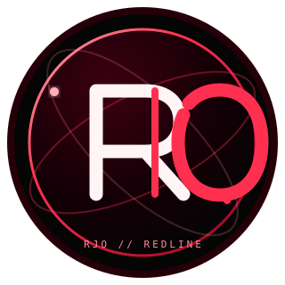

  

  

    
    
    
    
    
  

  

  
  
  
  
  
  

╱╱ CASE FILE // OLAYRESJAMES // STATUS: <strong>ACTIVE</strong> // SIGNAL: <strong>REDLINE</strong>

<h2 id="identity-brief">01 // IDENTITY BRIEF</h2>

<table>
  <tr>
    <td width="20%" valign="middle" align="center">
      
    </td>
    <td width="52%" valign="top">
      <h3>Building with intent.</h3>
      
I’m an Information Technology student from Valenzuela City, Philippines, who enjoys turning ideas into practical, user-centered products. My work sits at the intersection of full-stack development, mobile experiences, generative AI, and game UI/UX.

      
 <strong>Enterprise personnel systems, AI-assisted products, and thoughtful digital experiences.</strong>

    </td>
    <td width="28%" valign="top">
      <pre><code>ROLE       BSIT STUDENT
SCHOOL     PLV
BASE       VALENZUELA CITY
GRADUATING JUNE 2027
STATUS     ONLINE ●</code></pre>
    </td>
  </tr>
</table>

━━━ ◈ ━━━  IDENTITY VERIFIED  ━━━ ◈ ━━━

<table>
  <tr>
    <td width="50%" valign="top">
      <h3>✦ DESIGN PHILOSOPHY</h3>
      <blockquote><strong>Build systems that feel clear, useful, and a little unforgettable.</strong></blockquote>
      
CLARITY FIRST · HUMAN SCALE · BUILT TO LAST

    </td>
    <td width="50%" valign="top">
      <h3>⚡ NEXT MISSION</h3>
      
Sharpening full-stack architecture, accessible interaction design, and AI-assisted workflows while shipping work that solves real problems.

      
 

    </td>
  </tr>
</table>

  
  
  

<h2 id="operating-areas">02 // OPERATING AREAS</h2>

 

<table>
  <tr>
    <td width="33%" valign="top">
      <h3>01 // WEB + MOBILE</h3>
      
Responsive interfaces and full-stack products with thoughtful flows, real-time data, and polished interaction design.

      <code>PRODUCT · INTERFACE · FLOW</code>
    </td>
    <td width="33%" valign="top">
      <h3>02 // AI SYSTEMS</h3>
      
Practical AI integrations that make applications more useful, accessible, and responsive to real user needs.

      <code>CONTEXT · AUTOMATION · ASSIST</code>
    </td>
    <td width="33%" valign="top">
      <h3>03 // GAME EXPERIENCES</h3>
      
Game interfaces, interactive systems, and gameplay logic that make complex rules feel simple to use.

      <code>PLAY · SYSTEM · FEEL</code>
    </td>
  </tr>
</table>

<h2 id="loadout">03 // LOADOUT</h2>

╱╱ EQUIPMENT CHECK // THE RIGHT TOOL FOR THE RIGHT FEEL ╲╲

<h3>01 // LANGUAGES · CORE DAMAGE</h3>

<h3>02 // FRONTEND + MOBILE · INTERFACE</h3>

<h3>03 // BACKEND + DATA · ENGINE ROOM</h3>

<h3>04 // APIS + INFRASTRUCTURE · DEPLOYMENT</h3>

<h3>05 // AI SYSTEMS · AUGMENTATION</h3>

<h3>06 // TOOLS + WORKFLOW · CONTROL DECK</h3>

<h3>07 // QUALITY + DELIVERY · FINISHING MOVE</h3>

<h3>08 // NETWORKING · FIELD KIT</h3>

<h2 id="internship-case-files">04 // INTERNSHIP CASE FILES</h2>

CASE FILES // ENTERPRISE · OPERATIONS · FIELD SYSTEMS

Projects developed during internship work across enterprise systems, personnel operations, geospatial navigation, and assignment workflows.

━━━ ◈ ━━━  FIELD OPERATIONS  ━━━ ◈ ━━━

<table>
  <tr>
    <td colspan="2" valign="top">
      <h3>🏢 <a href="https://itms-armd-directory-two.vercel.app/">PAIS 2.0</a> ◆ FEATURED CASE</h3>
      
<strong>PNP-ITMS Personnel and Assignment Information System.</strong> Enterprise HR and personnel platform for uniformed and civilian personnel.

      
<code>React</code> <code>TypeScript</code> <code>Tailwind CSS</code> <code>Express</code> <code>Supabase</code>

      
◆ ENTERPRISE APP · 2026

    </td>
  </tr>
  <tr>
    <td width="50%" valign="top">
      <h3>🧭 CAMP-NAVI</h3>
      
Geofencing and navigation system for Camp Crame, built to support security and operational efficiency.

      
<code>Geofencing</code> <code>Navigation</code> <code>Security operations</code>

    </td>
    <td width="50%" valign="top">
      <h3>📍 <a href="https://pnp-survey.up.railway.app/">PNP Assignment System</a> ◆ FEATURED</h3>
      
Survey platform for collecting preferred locations to inform personnel movement and assignment decisions.

      
<code>Survey system</code> <code>Data collection</code> <code>Assignment workflow</code>

    </td>
  </tr>
  <tr>
    <td colspan="2" valign="top">
      <h3>🗂️ <a href="https://pnp-itms-internship-attendance.vercel.app/">PNP Internship Database Tracking Management System</a></h3>
      
Database and attendance tracking for PNP internship records and workflows.

      
<code>React</code> <code>Database</code> <code>Attendance tracking</code> <code>Vercel</code>

      
◆ CURRENT BUILD

    </td>
  </tr>
</table>

<h2 id="featured-builds">05 // FEATURED BUILDS</h2>

PRIMARY BUILDS // PRODUCTS WITH PEOPLE AT THE CENTER

 

<table>
  <tr>
    <td colspan="2" valign="top">
      <h3>🚑 <a href="https://download-agapai.vercel.app/">AgapAI</a> ◆ FEATURED</h3>
      
AI-assisted emergency support for seniors, guardians, and local responders.

      
<code>React</code> <code>Firebase</code> <code>Gemini AI</code> <code>React Native</code> <code>Expo</code>

    </td>
  </tr>
  <tr>
    <td width="50%" valign="top">
      <h3>📝 <a href="https://foliofy-omega.vercel.app/">Foliofy</a></h3>
      
Offline-first browser app that turns image collections into Word and PDF documents.

      
<code>JavaScript</code> <code>PWA</code> <code>docx.js</code> <code>jsPDF</code> · <a href="https://github.com/olayresjames/Foliofy">source</a>

    </td>
    <td width="50%" valign="top">
      <h3>🛍️ <a href="https://verdemelt-app.vercel.app/">Verdemelt Storefront</a></h3>
      
Polished storefront focused on product discovery, smooth browsing, and production-ready deployment.

      
<code>React</code> <code>Vite</code> <code>Tailwind CSS</code> <code>Vercel</code> · <a href="https://github.com/olayresjames/verdemelt-app">source</a>

    </td>
  </tr>
</table>

<h2 id="games-and-experiments">06 // SIDE QUESTS + EXPERIMENTS</h2>

SIDE QUESTS // INTERFACES · SYSTEMS · STORIES

<table>
  <tr>
    <td width="50%" valign="top">
      <h3>🎮 <a href="https://deckode.itch.io/reset-the-endless-horror">Reset: Endless Horror</a></h3>
      
Time-loop horror experience with a tense, decision-driven game interface.

      
<code>UI/UX</code> <code>Game UI</code> <code>Frontend</code>

    </td>
    <td width="50%" valign="top">
      <h3>🎴 <a href="https://pagpag-hybrid.vercel.app/">Pagpag: Shake, Battle & Roll</a></h3>
      
Digital companion that runs the rules engine and full gameplay loop for a physical card game.

      
<code>HTML</code> <code>CSS</code> <code>JavaScript</code> <code>Vercel</code> · <a href="https://github.com/olayresjames/Pagpag-Hybrid">source</a>

    </td>
  </tr>
  <tr>
    <td width="50%" valign="top">
      <h3>🗡️ <a href="https://github.com/olayresjames/Sword-Phantasia">Sword Phantasia</a></h3>
      
Desktop RPG combining a custom Tkinter interface with Pygame-powered audio and interaction.

      
<code>Python</code> <code>Tkinter</code> <code>Pygame</code> · <a href="https://github.com/olayresjames/Sword-Phantasia">source</a>

    </td>
    <td width="50%" valign="top">
      <h3>☕ <a href="https://suriels-cafe.vercel.app/">Suriel's Cafe Platform</a></h3>
      
Cafe platform combining online ordering, table reservations, and role-based dashboards.

      
<code>HTML</code> <code>CSS</code> <code>JavaScript</code> <code>Supabase</code>

    </td>
  </tr>
</table>

<h2 id="signal-activity">07 // SIGNAL ACTIVITY</h2>

  
  
   
  

<h2 id="lets-connect">08 // LET’S CONNECT</h2>

Have an idea worth building, a project to collaborate on, or simply want to talk about tech and games? I’d love to hear from you.

  
  

 

